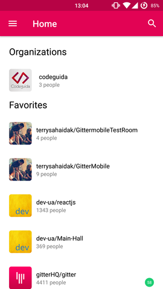
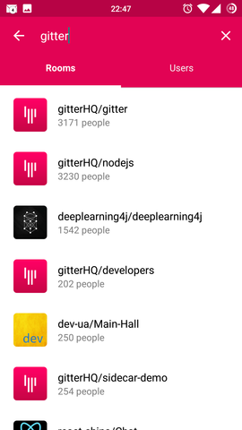
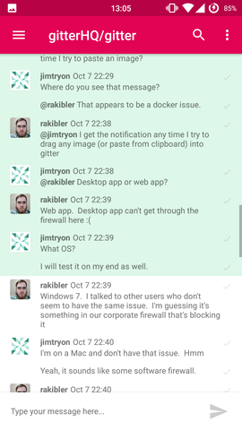
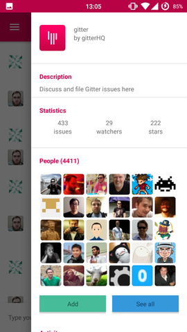
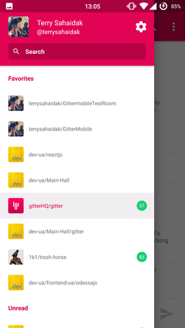

## App preview








## Technical stack
- [React Native](https://facebook.github.io/react-native/)
- [Redux](http://redux.js.org/)
- [react-native-navigation](https://github.com/wix/react-native-navigation)
- [react-native-vector-icons](https://github.com/oblador/react-native-vector-icons)
- [react-invertible-scroll-view](https://github.com/expo/react-native-invertible-scroll-view)
- [react-native-fetch-blob](https://github.com/wkh237/react-native-fetch-blob)
- [react-native-scrollable-tab-view](https://github.com/skv-headless/react-native-scrollable-tab-view)
- [react-native-transformable-image](https://github.com/terrysahaidak/react-native-transformable-image)

## Installation
Once you have downloaded or cloned this repository, run `npm install` inside the directory, then you need to create `local.js` file inside `app` directory with following content:

```
export const CLIENT_ID = 'oauth key'
export const CLIENT_SECRET = 'oauth secret'
export const REDIRECT_URI = 'redirect url'
```